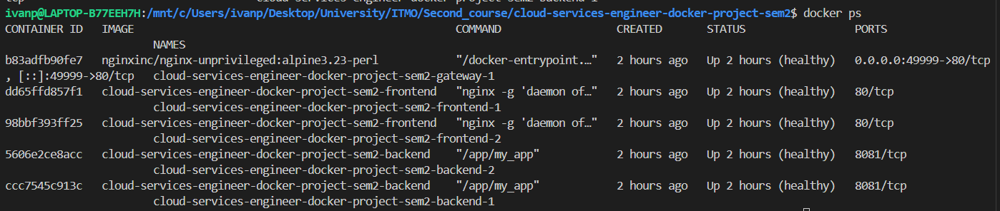
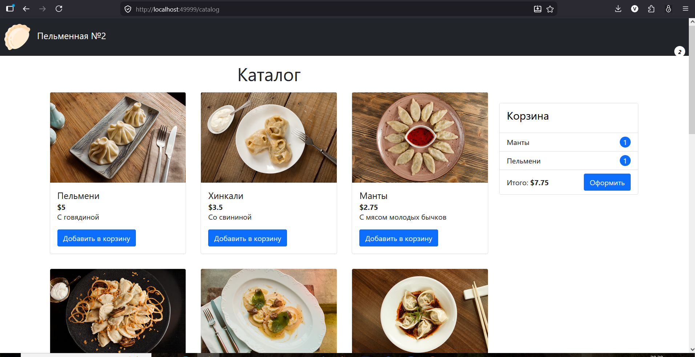
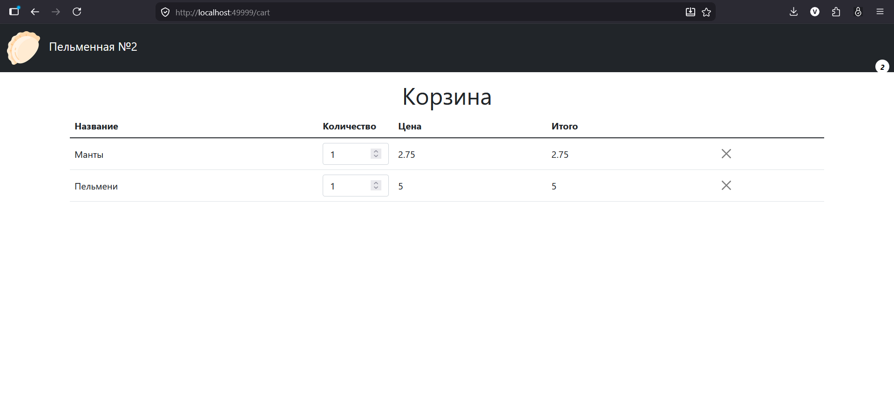

# Проект по дисциплине Docker Попов Иван Алексеевич

Проект сайта пельменной. Основные задачи, достигнутые в результате выполнения проекта:

1) Сборка образова для бэка и фронта. Реализованы:
  - Multi-stage сборка;
  - запуск от непривелегированного пользователя (non-root);
  - healthcheck;
  - легковесные образы.

2) Масштабирование в рамках docker-compose:
  - количество реплик для фронтэнда и бэканда: 2 для каждого сервиса;
  - внешний балансировщик.

3) Безопасность:
  - сканирование образов Trivy;
  - настройка Linux Capabilitys
  - ограничения ресурсов
---

## [Backend](./backend/Dockerfile)

ЯП: `golang`
Базовый образ после сборки: `alpine`

Реализована:
 - Запуск бинарного файла от `non-root` юзера
 - `multi-stage` сборка
 - healthcheck
 - :8081 порт (Expose в Dockerfile)
 - 2 реплики

Итоговый вес образа составил - `61.5MB`, где content size `20.4MB`.

## [Frontend](./frontend/Dockerfile)

Фреймворк: vue.js
Базовый образ после сборки: `alpine-nginx`

Реализовано:
 - Запуск `nginx` от `non-root` юзера
 - `multi-stage` сборка
 - healthcheck
 - :80 порт (Expose в Dockerfile)
 - `nginx.conf` для отдачи статики сразу в образе (настроен resolver на dns docker-compose и балансировка для бэкенда)
 - Выданы права тольно на то, что касается `nginx`
 - 2 реплики

Итоговый вес образа составил - `94.9MB`, где content size `26.3MB`.

## [Gateway] (./nginx.conf)

Конфигурация для nginx в качестве reverse-proxy.
Базовый образ: `nginx-unprivileged`

Реализовано:
  - балансировка фронтенда
  - монтирование конфигурации в read-only
  - compose: переменная окружения `NGINX_PORT` для запуска gateway на кастомном порту (по умолчанию 80 порт хоста)

## [Docker compose для прода](./docker-compose.prod.yml)

Созданы файлы для `dev` и `prod` окружения. В `dev` окружении реплики не прописаны и образы собираются _локально_. 

Отличие `docker-compose.yml` от `docker-compose.prod.yml` - первый создан для корректной работы Actions и вместо директивы `image` используется `build`

Сервисы запускаются в следующей очередности:
1) Бэк в 2ух репликах; 
2) После Healthcheck бэка: Фронт в 2ух репликах;
3) После Healthcheck фронта: Gateway, балансирующий трафик между фронтендом

Что сделано:
- Настроены healthchek's
- Образы пулятся с `dockerhub`
- Логин `DOCKERHUB` и `NGINX_PORT` передается через переменные окружения или через `.env`
- Отключены все Linux Capability внутри контейнеров, за исключение NET_BIND_SERVICE
- Бэк изолирован с точки зрения сети (`backend-net`), доступ имеет только фронтэнд
- Подключен `volume` к директории `var/log/nginx`
- Настроены ограничения ресурсов:
    - backend: 5% мощности ядра, 100MB RAM
    - frontend: 5% мощности ядра, 25MB RAM
    - gateway: 5% мощности ядра, 30MB RAM
- Настроена репликация для бэка и фронта

> [!Запуск]
> Запуск `docker compose -f <docker-compose file> up/down`
> Запуск gateway на кастомном порту `NGINX_PORT=<my_cool_port> docker compose -f <docker-compose file> up/down`

## Workflow
Добавлен сканнер уязвимостей образов - `Trivy`.
Результат сканирования доступен в виде csv-отчетов в артефактах
 
## Скриншоты

Определение сервисов в Docker desktop

CLI

Главная страница пельменной

Корзина после заполнения
